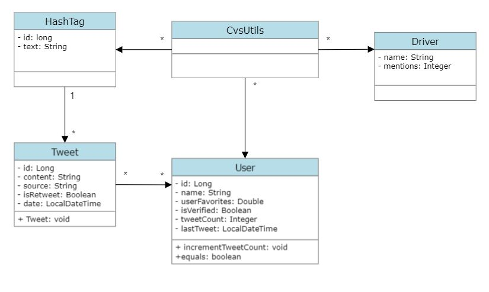

# Grupo8-p2-tads

Obligatorio programación 2 UM

## Contenido:

1. Diagrama UML de clases de la solución.
2. Breve descripción de las funciones.
3. Medición de la eficiencia.

## UML



----

#### BREVE DESCRIPCIÓN DE LAS FUNCIONES

En un principio, cuando se ejecuta el programa "Main", se ejecuta la función `getCsvInfo()`, la cual se utiliza para extraer la información correspondiente del documento dado por la letra. Esta información es procesada y clasificada en "user", "tweet" y "hashtag" según corresponda. Además, se realiza una LinkedList de cada uno.

Las fechas fueron ingresadas utilizando el tipo de dato DateTime.

1. **Reporte 1:**
   Llama a la función `top15UsersWithMoreTweets()`.

   Esta utiliza la técnica Heap Sort, poniendo a los usuarios en un heap, quedando estos ordenados por cantidad de tweets. Luego, toma con la función `delete` los 15 usuarios con mayor cantidad de tweets y los imprime.

2. **Reporte 2:**
   Llama a la función `differentHashTagsForADay(LocalDate date)`.

   Primero, crea un HashTable donde los diferentes hashtags se van a guardar. Se recorre la lista de tweets, filtrándolos por fecha. Aquellos que corresponden al día ingresado:
    - Chequea que no sea igual a ningún hashtag que ya esté en el HashTable de hashtags.
    - Si no está, lo agrega.

   Una vez que termina, imprime los resultados.

3. **Reporte 3:**
   Llama a la función `mostUsedHashTagForADay(LocalDate date)`.

   La función crea una HashTable llamada `hashTagHashTable`, donde se van a guardar los String hashtags (key) y las veces que este se repite (value). Se recorre la lista de tweets para filtrarlos por fecha. Si la fecha del tweet es la correcta, se verifica si los hashtags que este contiene ya existen en la hashtable. Si no existen, se los agrega (ignorando f1). Si ya existen, les suma 1 a su value. Además, va manteniendo cuenta del `maxCount` y el `maxHashTag`.

   Al final se imprimen los resultados.

4. **Reporte 4:**
   Llama a la función `top7UsersWithMoreFavourites()`.

   Se ordena la lista `userLinkedList` utilizando la expresión lambda de comparación, siendo el criterio los favoritos de cada usuario en orden descendiente. Se define un límite de usuarios a mostrar como 7. Se itera con un for sobre la lista resultante para imprimir el resultado del usuario y la cantidad de favoritos.

5. **Reporte 5:**
   Llama a la función `tweetsWithSpecificWordOrPhrase(String wordOrPhrase)`.

   A través de un contador (que comienza en cero), se recorre toda la lista de tweets buscando esa palabra o frase. Para evaluar esto último, se convierte en minúscula para igualar la lectura. Si el tweet siendo evaluado contiene el string ingresado, el contador aumenta 1. Imprime la cantidad de veces que esa palabra se repite en todos los tweets.

6. **Reporte 6:**
   Llama a la función `getTopTenPilots(int month, int year)`.

   Esta crea un Heap donde se ingresarán los drivers ordenados por su cantidad de menciones. Primero, se filtran los tweets por fechas. Luego, si la fecha corresponde, se verifica si coincide su contenido con algún nombre de la `driversLinkedList

`. Si esto es así, se aumenta el contador de menciones del piloto.

Luego, se ingresan los pilotos al Heap. Iterando 10 veces y utilizando el método `delete`, se imprimen los 10 pilotos con el número más alto de menciones.

---

#### MEDICIÓN DE LA EFICIENCIA

El tiempo de ejecución de cada función y la memoria que esta ocupa se calcula luego de la realización del reporte correspondiente.

Metodología:

Al implementar las funciones, se le agregan las siguientes líneas de código:

```java
Scanner scanner = new Scanner(System.in);
String dateString = scanner.nextLine();
LocalDate date = LocalDate.parse(dateString);
Runtime rt = Runtime.getRuntime();
long total_mem = rt.totalMemory();
long loadStartTime = System.currentTimeMillis();
measureMemoryAndTime(rt, total_mem, loadStartTime);
```

Estas líneas registran el tiempo que demora la ejecución en milisegundos y la memoria total que ocupa. Estos se imprimen junto al resultado de la función.