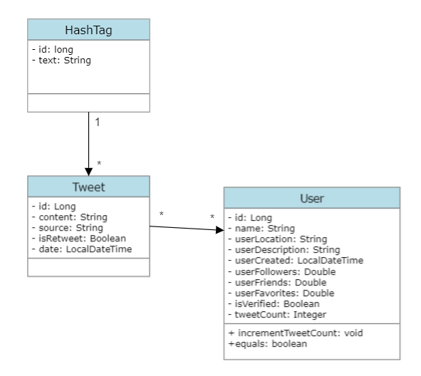

# Grupo8-p2-tads

Obligatorio Prog2 UM

## Contenido:

1. Diagrama UML de clases de la solución.
2. Breve descripción de los procesos de carga y realización de reportes.
3. Medición de eficiencia de la aplicación. Para ello se deberá indicar, tanto para la carga como para la ejecución de los reportes:
    - Cantidad de memoria RAM consumida.
    - Tiempo de ejecución promedio.

Un archivo `README.txt` describiendo los procesos de carga, las decisiones tomadas y el consumo de memoria en cada reporte.

## UML

## Breve descripción de las funciones

En un principio, cuando se ejecuta el programa "Main", se ejecuta la función `getCsvInfo()`, la cual se utiliza para extraer la información correspondiente del documento dado por la letra. Esta información es procesada y clasificada en "user", "tweet" y "hashtag" según corresponda. Además, se realiza una LinkedList de cada uno.

Las fechas fueron ingresadas utilizando el tipo de dato `DateTime`.

### Reporte 1

Llama a la función `top15UsersWithMoreTweets()`.

Esta función crea una linked list llamada "topUsers" donde se van a guardar aquellos usuarios que tengan más tweets. Se recorre una linked list de los usuarios, comparando su cantidad de tweets con aquellos que se encuentran en la lista topUsers. Cuando encuentra uno donde la cantidad de tweets del usuario evaluado es mayor a la cantidad del que forma parte del top 15, lo agrega ahí; esto hace que queden ordenados.

En un principio, a los primeros 15 usuarios evaluados se los agrega directamente a `topUsers`. Cuando la lista de `topUsers` tiene más de 15 usuarios, se elimina el último, que al estar ordenados, no es parte del top 15.

Cuando termina de recorrer todos los usuarios, imprime los resultados obtenidos en `topUsers`.

### Reporte 2

Llama a la función `differentHashTagsForADay(LocalDate date)`.

Primero, crea una lista donde los diferentes hashtags se van a guardar. Se recorre la lista de tweets, filtrándolos por fecha. Aquellos que corresponden al día ingresado:
- Chequea que no sea igual a ningún hashtag que ya esté en la lista de hashtags.
- Si no está, lo agrega.

Una vez que termina, imprime los resultados.

### Reporte 3

Llama a la función `mostUsedHashTagForADay(LocalDate date)`.

La función crea una HashTable llamada `hashTagHashTable`, donde se van a guardar los String hashtags (key) y las veces que este se repite (value). Se recorre la lista de tweets para filtrarlos por fecha. Si la fecha del tweet es la correcta, se verifica si los hashtags que este contiene ya existen en la hashtable. Si no existen, se los agrega (ignorando f1). Si ya existen, se les suma 1 a su value.

Para encontrar el hashtag más utilizado (el de mayor value), se utiliza la interfaz de `Enumeration` para las keys de la hashtable. Se busca el máximo valor del value comparándolo con el máximo actual (se actualiza mientras se va recorriendo las diferentes keys). Al final, se imprimen los resultados.

### Reporte 4

Llama a la función `top7UsersWithMoreFavourites()`.

Esta función va comparando la cantidad de favoritos de la

`userLinkedList`. Luego, coloca los 7 mejores en una linked list de tamaño 7. Imprime los resultados.

### Reporte 5

Llama a la función `tweetsWithSpecificWordOrPhrase(String wordOrPhrase)`.

A través de un contador (que comienza en cero), se recorre toda la lista de tweets buscando esa palabra o frase. Para evaluar esto último, se convierte en minúscula para igualar la lectura. Si el tweet siendo evaluado contiene el string ingresado, el contador aumenta 1. Imprime la cantidad de veces que esa palabra se repite en todos los tweets.

### Reporte 6

Llama a la función `getTopTenPilots(int month, int year)`.

Esta función crea una HashTable donde se ingresarán los pilotos como key y las veces que estos son mencionados en los tweets como value. Primero, se filtran los tweets por fechas. Luego, si la fecha corresponde, se verifica si coincide su contenido con algún nombre de la `driversLinkedList`. Si esto es así, se aumenta el value de key=piloto. Se imprimen los primeros 10 pilotos del HashTable.